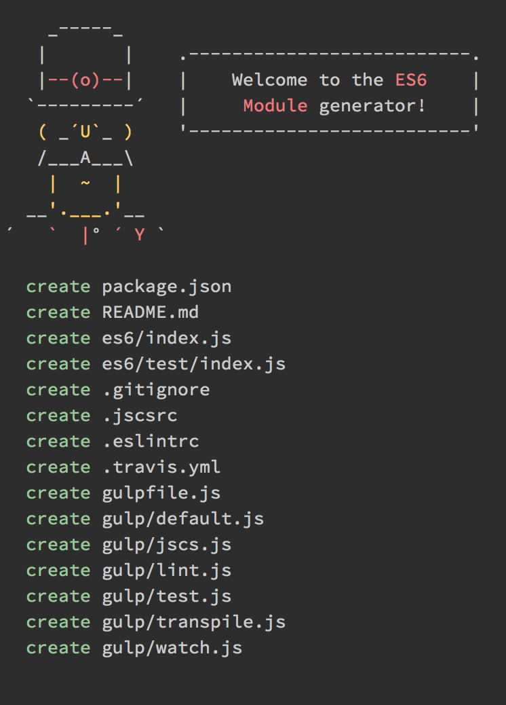

# generator-es6nm

> Scaffold out a node module written in ES6




## Install

```
$ npm install --global generator-es6nm
```


## Usage

With [yo](https://github.com/yeoman/yo):

```
$ yo es6nm
```


## Tip

Use [chalk](https://github.com/sindresorhus/chalk) if you want colors in your CLI.


## License

MIT © [Will Vaughn](http://twitter.com/nackjicholson)
